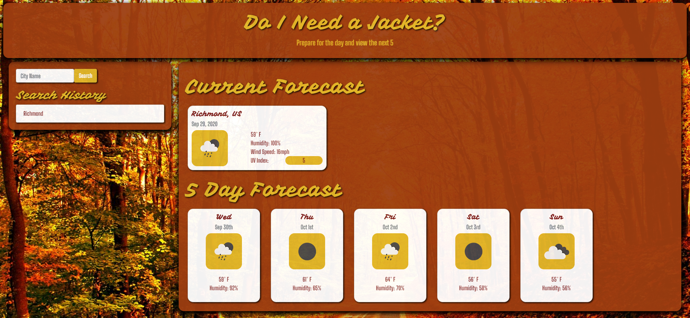
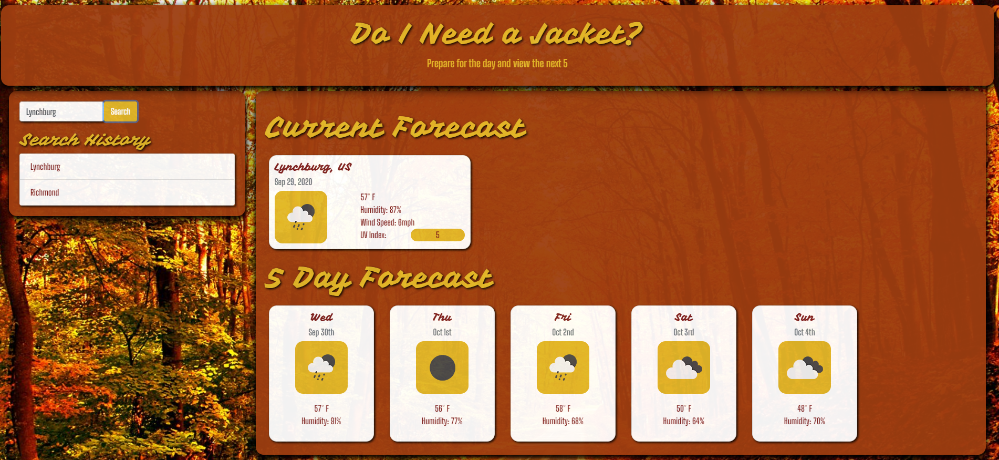
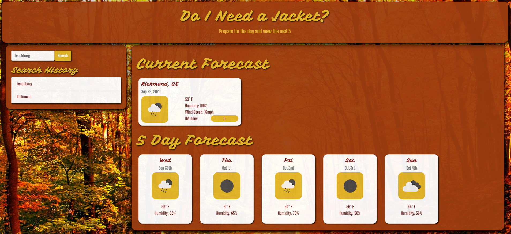
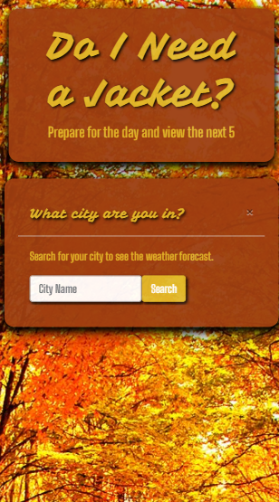
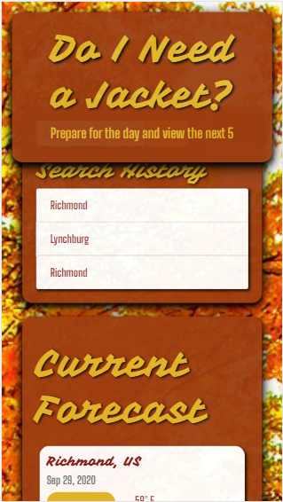

# Do I Need a Jacket?

## Project Summary
Weather Dashboard displaying user searched city's data for specified weather metrics and saved search history. 

## Technologies Used

Utilizes third party API openweathermap, local storage for persistent data, and bootstrap for clean formatting and responsive design 

## Deployed Web App

[Do I Need a Jacket?](https://mhall313.github.io/weather-db/)

## GitHub Repo

[Do I Need a Jacket Repo](https://github.com/mhall313/weather-db)

## Screenshots of the Application

## Future State Implemenation

- Search entry validation - when the user misspells or does not enter a city name, the app will ask for validation and reentry
- Addition of the State the city is located into the header which states the city name
- Clear the search field of the previously searched city name so that the placeholder is visible again as "City Name"

## Contact Information

- Developed by Melanie Hall
- Email: hallmt313@gmail.com
- Linkedin: https://www.linkedin.com/in/hallmelanie
- Resume: [link](assets/MelanieHallResume.pdf)
